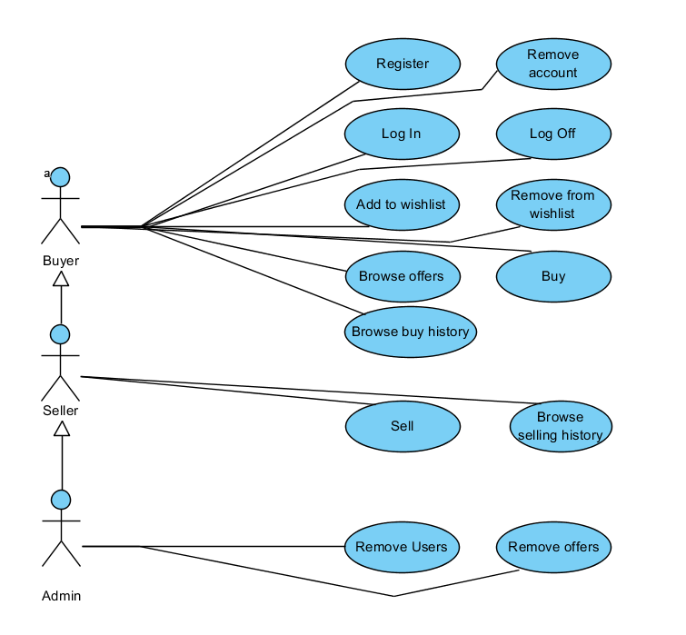

# Bazy danych 2
## Serwis aukcyjny
#### Prowadzacy:
Jarosław Rudy

#### Wykonawcy:
* Ormaniec Wojciech  
* Rodziewicz Bartosz

#### Daty oddania:
* Etap I - 10/24/2017

### Opis "świata rzeczywistego":

Klienci dzielą się na dwie grupy:
* kupujący
* sprzedający

Kupującym jest każdy klient. Sprzedającym może stać się każdy, jednak musi to aktywować w ustawieniach.

Aby stać się klientem trzeba się zarejestrować w systemie. Klient jest reprezentowany przez unikalną nazwę użytkownika.

Kupujący może:
* przeglądać oferty sprzedaży,
* kupować produkty,
* dodawać i usuwać produkty do/z listy na później (wishlist),
* edytować swoje ustawienia (zmiana hasła, zmiana avatara, itd.),
* Przeglądać historię zakupów.

Sprzedający dodatkowo może:
* wystawiać produkty na sprzedaż,
* Przeglądać historię sprzedanych produktów.

Osoba niezalogowana może jedynie przeglądać dostępne oferty.

Aukcja jest reprezentowana przez unikalny numer. Zawiera też informacje o tym czy produkt został sprzedany. Na aukcji wystawiona może być maksymalnie jedna sztuka towaru.

Administrator może dodatkowo (korzystając ze specjalnego panela administracyjnego):
* moderować oferty (edycja/usuwanie)
* moderować użytkowników (usuwanie)

### Dane techniczne

* Serwis będzie stroną internetową. Klienci mogą korzystać z serwisu poprzez przeglądarkę. Jednocześnie strona może być używana przez ~1000 osób.
* Baza nie będzie przechowywać haseł użytkowników, a jedynie ich hash, co powoduje niemożliwość odzyskania hasła (tylko zmiana na nowe poprzez link wysyłany na maila).
* Hasło użytkownika musi mieć minimum 8 znaków. Może składać się z dowolnej kombinacji małych i wielkich liter, liczb i znaków specjalnych. Hasła będą posiadały dodatkowy element aka "Salt".
* Strona będzie działać przez protokół HTTP, strona logowania, edycji konta i panel administracyjny poprzez HTTPS.
